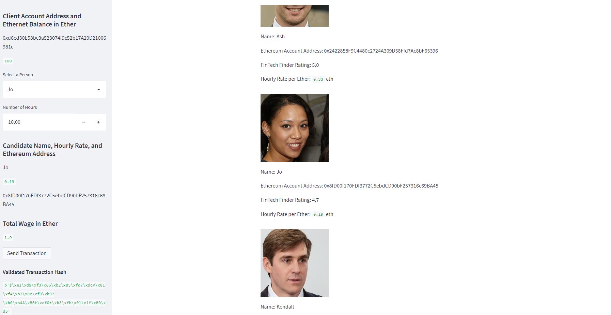
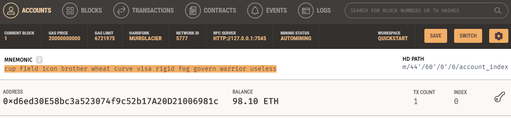
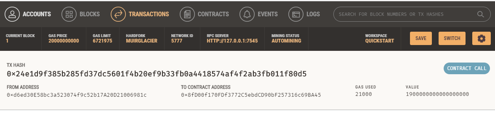

# Challenge_19_Blockchain_Wallets

Complete the following steps:

# 1. From your terminal, navigate to the project folder that contains
# your `.env` file and the `fintech_finder.py` and `crypto_wallet.py` files.
# Be sure to activate your Conda `dev` environment if it is not already active.

# 2. To launch the Streamlit application,
# type `streamlit run fintech_finder.py`.

# 3. On the resulting webpage, select a candidate that you would like to hire
# from the appropriate drop-down menu. Then, enter the number of hours that you
# would like to hire them for. (Remember, you do not have a lot of ether in
# your account, so you cannot hire them for long!)

# 4 Click the Send Transaction button to sign and send the transaction with
# your Ethereum account information. If the transaction is successfully
# communicated to Ganache, validated, and added to a block,
# a resulting transaction hash code will be written to the Streamlit
# application sidebar.

# 5. Navigate to the Ganache accounts tab and locate your account (index 0).
    # * Take a screenshot of the address, balance, and transaction (TX) count.
    # Save this screenshot to the README.md file of your GitHub repository for
    #  this Challenge assignment.

# 6. Navigate to the Ganache transactions tab and locate the transaction.
    # * Click the transaction and take a screenshot of it.
    # Save this screenshot to the README.md file of your GitHub repository for
    #  this Challenge assignment.

